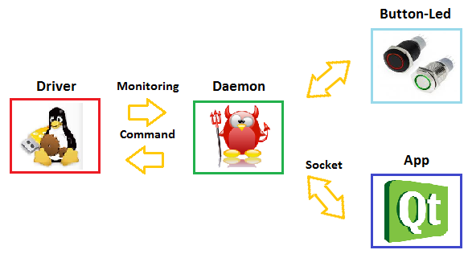

Mini-Project
============

Kernel Driver
-------------

Daemon
------

Introduction
This project is to realize a Daemon that communicate with the driver and the application. For the communication with the driver, the sysfs communication will be used and for the application, we decided to use an ip linux socket as IPC.

Overview
The program communicate with the driver, it can set the duty cycle (0 to 100) value and change the mode (auto or manual). The temperature can be read (RO) from the driver.

The button on the board change the mode, and the fan speed. An application communicate through socket to interact with the daemon is implemented. All datas are passed to the driver through the daemon application, as shown in the following image.

Board interaction
^^^^^^^^^^^^^^^^^

The user can user 3 switch on the extension board to change the mode and control the speed of the fan.

 - The first button SW1 switch the mode between auto and manual.
 - The second button SW2 increase 10% the fan speed on manual mode otherwise in auto mode do nothing
 - The button SW3 does the same as SW2 but decrease 10% the speed fan.

Socket interaction
^^^^^^^^^^^^^^^^^^

The fan speed can be change and set from a remote socket connected to this daemon. The protocol implemented is the following:

	:mode=[auto,manual]:	to change the mode in the mode specified by a string end line terminated.

	:duty=[0-100]:	to change the duty cycle, can be a value from 0 to 100

	:show:	to display the current settings in this format mode[],duty[],temp[]

	:help:	show this help
	
	
	
Explication
^^^^^^^^^^^

The daemon program is divided in five parts as follow:

 1. Initialize the daemon
 2. Initialize the communication with GPIO (LED,SWITCH), the driver, the server(port=8080), timer
 3. Set the default states (mode=auto, duty=50)
 4. Create EPOLL loop
 5. Start forever in the event loop

All the following part are synchronized in the EPOLL loop.

Daemon
^^^^^^

The initialize of the daemon the process is the following

 - fork off the parent process
 - create new session
 - fork again to get rid of session leading process
 - capture all required signals
 - update file mode creation mask
 - change working directory to appropriate place
 - close all open file descriptors
 - redirect stdin, stdout and stderr to /dev/null
 - option: open syslog for message logging
 - option: get effective user and group id for appropriate's one
 - option: change root directory
 - option: change effective user and group id for appropriate's one
 - launch the body function

The creation of the daemon is done in the main function then it calls the body function that run the program.

GPIO
^^^^

The following function open a gpio in which direction is passed in parameter. Then for the led the direction should be in output and for the button in input:

.. code-block:: c

	static int open_gpio(char* pin, char* direction)

Driver
^^^^^^

The communication with the driver is by SYFS, then the only things to do is to open the following filedescriptor in the program and the communication is bidirectional, thanks to the last parameter.

.. code-block:: c

	int fmode = open("/sys/devices/platform/fan-ctrl/mode",O_RDWR);
	int fduty = open("/sys/devices/platform/fan-ctrl/duty",O_RDWR);
	int ftemp = open("/sys/devices/platform/fan-ctrl/temp",O_RDONLY);

Server
^^^^^^

The server is listening on port 8080, by these two function the server listen and accept connection in a non-blocking state:

.. code-block:: c

	int make_socket_non_blocking (int sfd)
	int create_and_bind (char *port)

The following part of code create the server and make the server socket non-blocking. In this mode the program can continue to run even if no client is connected.

.. code-block:: c

    int sfd = create_and_bind ("8080");
    if (sfd == -1)
        exit(-1);
    ret = make_socket_non_blocking (sfd);
    if (ret == -1)
        exit(-1);
    ret = listen (sfd, SOMAXCONN);
    if (ret == -1){
        perror ("listen");
        exit(-1);
    }

Timer
^^^^^

The timer is started when a user button is pressed and cleared after a while. Then reset the led state. Its reset if the button is pressed while the downcount.

.. code-block:: c

    timfd = timerfd_create(CLOCK_MONOTONIC, TFD_CLOEXEC);

    its.it_value.tv_sec = 0;
    its.it_value.tv_nsec = 400000000;
    its.it_interval.tv_sec = 0;
    its.it_interval.tv_nsec = 0;

Each 400ms the leds are shutdown, when they light up.

Application
-----------

